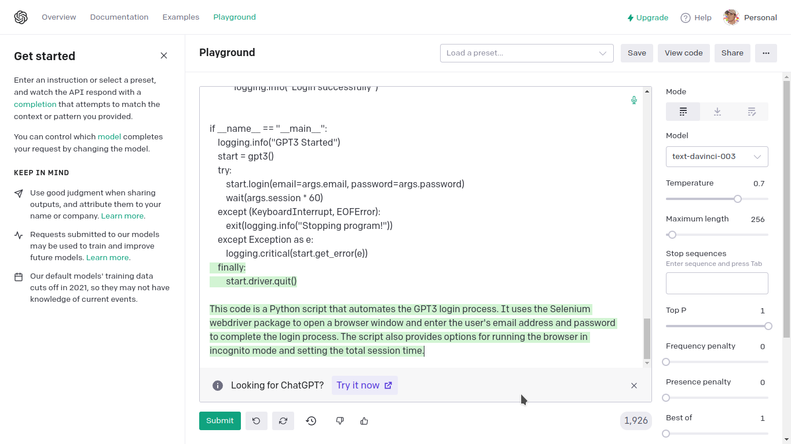

# gpt-login
<p align="center">
 <a href="#"></a>
 <a href="https://wakatime.com/badge/github/Simatwa/gpt-login"></a>
  <a href='#'></a>
</p>

Automate GPT-Login process.



## Independencies 

* Selenium
* Undetected-chromedriver

## Pre-requisites

1. **Google Chrome Browser** installed.
2. Google account

## Installation and Usage

## Installation

- Clone this repo then execute `install.sh` file.

```sh
$ git clone https://github.com/Simatwa/gpt-login.git
$ bash install.sh
  #or
$ sudo bash install.sh
```
# Usage

`gpt-login` followed by [Google](https://google.com) mail-address and finally  the account `password` is enough to get you started.

-  For instance :

 ```sh
 $ gpt-login example@gmail.com 123456
```

- For further info run `gpt-login --help` 

```
usage: gpt-login [-h] [-v] [-d DRIVER] [-se SESSION] [--incognito]
                 email password

Automate GPT3 login-process

positional arguments:
  email                 Google mail-address
  password              Passphrase for the account

optional arguments:
  -h, --help            show this help message and exit
  -v, --version         show program's version number and exit
  -d DRIVER, --driver DRIVER
                        Absolute path to chromedriver
  -se SESSION, --session SESSION
                        Total session time in minutes
  --incognito           Run browser in incognito mode
  ```

  ## Acknowledgements

  - [x] [Undetected-chromedriver](https://github.com/ultrafunkamsterdam/undetected-chromedriver)
